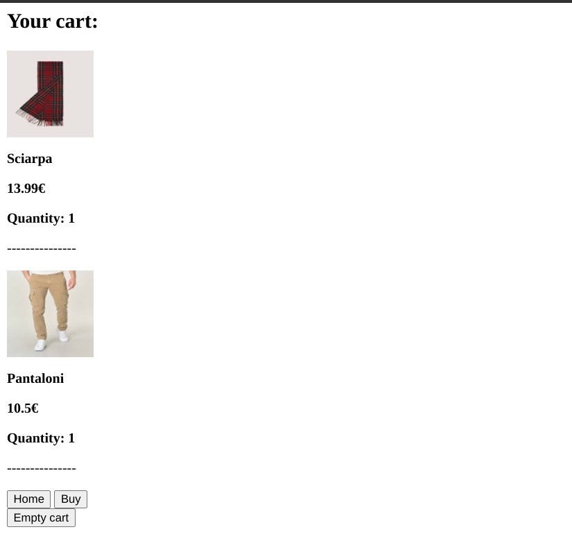

# Overview

I used django for the frontend part and it is divided in various html pages, a ```views.py``` file that creates the logic of the frontend application and a ```urls.py``` file that uses the path to connect the view, the enpoint to the html pages. I've create a home page that allows us to enter the product list or go to the cart.


By clicking on "go to your cart" it opens the cart page:



In the "my cart" section we have the possibility to go back to the home (available in every pages), the button to empty the cart and the one to buy. Also I introduced a check to see if the cart was empty or not, going to an error page if the cart is empty and we try to buy.
If the cart is not empty and we decide to buy the products we are sent to the shipping and billing information page:


Here I apply the logic that will sanitize the input by checking if in the form are present some special characters. If all goes all right we should have this message:


Instead by entering the product list we have a list of the elements inside the database:


Here we have a button to add the single product inside our cart or a link to a more detailed description about the product that we have in store:


Or we could check our order history:


I have created a backend application that implement all the logic and the necessity of the frontend part. I used fastAPI with Pydantic in order to control the information before being submitted to the database, so I created a layer of protection against SQL Injections and XSS attacks. By decoupling the frontend from the backend and having exposed the backend functionality through APIs, one could also add a security on the API itself making it even more robust.

The technologies I decided to use are:
- FastAPI to expose endpoints
- Postgres as database
- SqlAlchemy as an interface with the database

# Endpoint description


## Endpoint 1 - Returns the list of all the products in the database
Route:
```bash 
/products_list
```
Output:
```json 
{
    "products":
        {
            "id": "67c251dc-a082-4314-9f01-db70702aa1a2",
            "name": "Sciarpa",
            "price": 13.99,
            "description": "Sciarpa a quadri",
            "image": "images/sciarpa a quadri.jpeg",
            "icon": "icons/squared scarf icon.jpg"
        },
}
```

## Endpoint 2 - Adds a product inside the database
Route: 
```bash
/add_product
```
Input:
```json 
{
    "user_id" : "34bd8a5f-1ff5-404b-9791-1d58ded5862d", 
    "product_id" : "cfdf55a8-0ee3-4da2-a0f9-5ccf722dee27", 
    "quantity" : 1
}
```
Output:
```json 
{
    "added": true
}
```


## Endpoint 3 - Returns the details of a specific product
Route: 
```bash
/product_details
```
Input:
```json 
{
    "product_id" : "67c251dc-a082-4314-9f01-db70702aa1a2"
}
```
Output:
```json
{
    "product_name": "Sciarpa",
    "product_description": "Sciarpa a quadri",
    "product_price": 13.99,
    "product_image": "images/sciarpa a quadri.jpeg",
    "quantity": 8
}
```

## Endpoint 4 - Returns the history of the order based on the user
Route:
```bash 
/order_history
```
Input: 
```json
{
    "user_id" : "34bd8a5f-1ff5-404b-9791-1d58ded5862d"
}
```
Output:
```json
"orders_list": [
        {
            "order_id": "053f6df4-3d49-4d8a-9679-eebe9d0ee494",
            "date": "2024-04-04T16:33:01.563068"
        },
        {
            "order_id": "2d6576b0-8336-4399-b8a8-3f49c795e699",
            "date": "2024-04-04T16:46:34.777416"
        },
        {
            "order_id": "4359cbdd-1c55-4f4b-98cf-bba8be6ef9bd",
            "date": "2024-04-04T16:49:33.095415"
        },
]
```

## Endpoint 5 - Inserts the billing and shipping information for the buy operation

Input: 
```json
{
    {
        "user_ID" : "34bd8a5f-1ff5-404b-9791-1d58ded5862d", 
        "name" : "Andrea", 
        "last_name" : "Marras", 
        "cf" : "fheiskgorkske", 
        "address": "Via Ugo Pesci 15", 
        "billing_address": "Via Ugo Pesci 15"
    }
}
```
Output:
```json
"orders_list": [
        {
            "success": true
        },
]
```

## Endpoint 6 By using the user ID as input we obtain all the orders ID for that specific user

Input:
```json

{
    "user_ID" : "34bd8a5f-1ff5-404b-9791-1d58ded5862d"
}

```
Output:
```json

{
    "order_id": "46868f27-b23d-4f2b-a589-81c350c1f81d"
}

```

## Endpoint 7 We obtain the details of every single product present in the cart
Input:
```json
{
    "user_id" : "34bd8a5f-1ff5-404b-9791-1d58ded5862d"
}
```
Output:
```json
 "products": [
        {
            "id": "d02b03e5-3ee2-445f-ba46-bb6c4198d24d",
            "name": "Scarpe",
            "price": 11.0,
            "description": "Scarpe nere",
            "image": "images/scarpe.jpg",
            "quantity": 9
        },
 ]
```

## Endpoint 8 The removal of every single product inside the cart

Input:
```json
{
    "user_id" : "34bd8a5f-1ff5-404b-9791-1d58ded5862d"
}
```
Output:
```json
 "products": [
    {
        "removed": true
    }
 ]
```


# Local run steps

1) Run docker for postgres and fastAPI 
```bash
docker-compose -up
```
2) Execute the script to populate the database with the sample data 
```bash
psql -h <IP_DATABASE> -p <PORT_DATABASE> -d postgres -U user < sqlfile_real.sql
```
default ip database is 10.0.0.15 and port is 5432

3) Access the website by inserting in your browser:
```bash
http://<IP_FRONTEND>:<PORT_FRONTEND>/webapp/home.html
```
default ip of the frontend is 10.0.0.16 and port is 8000